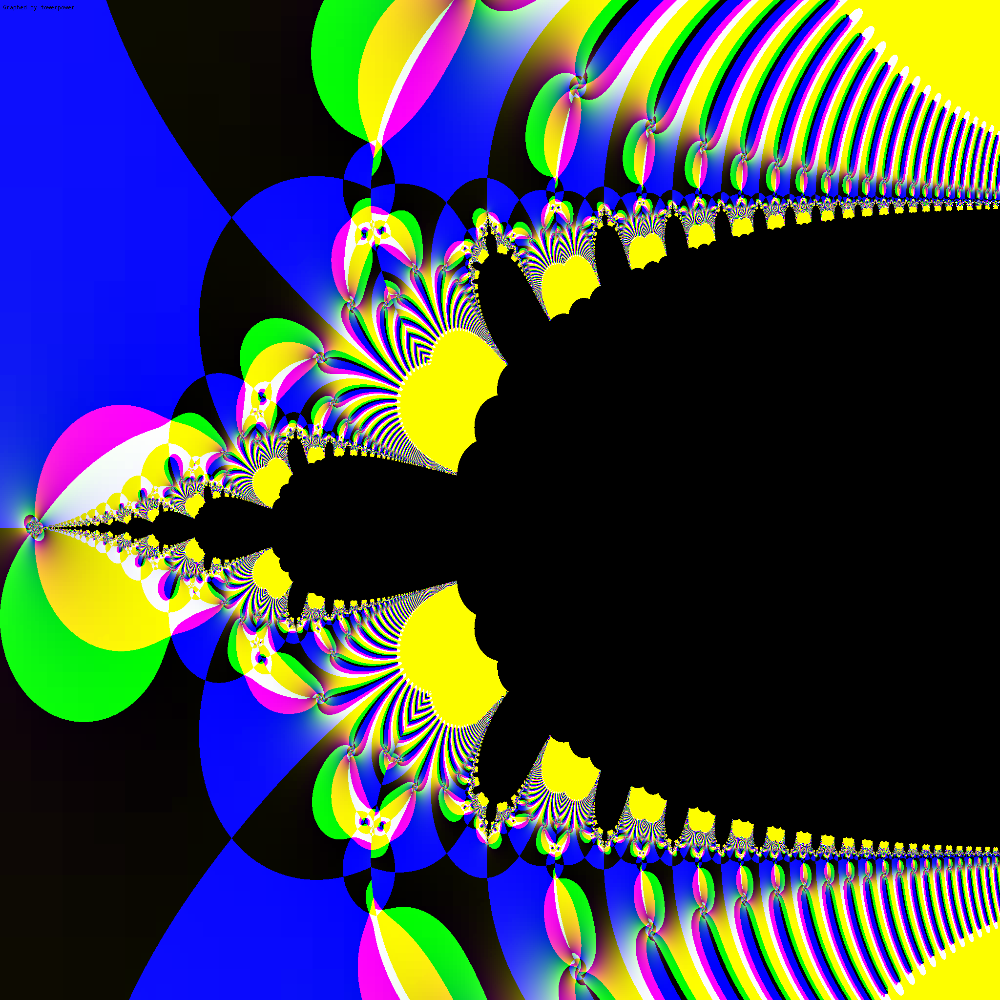
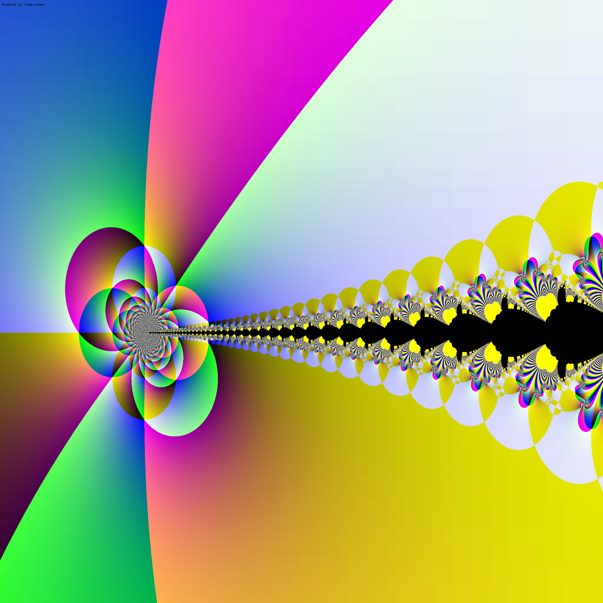
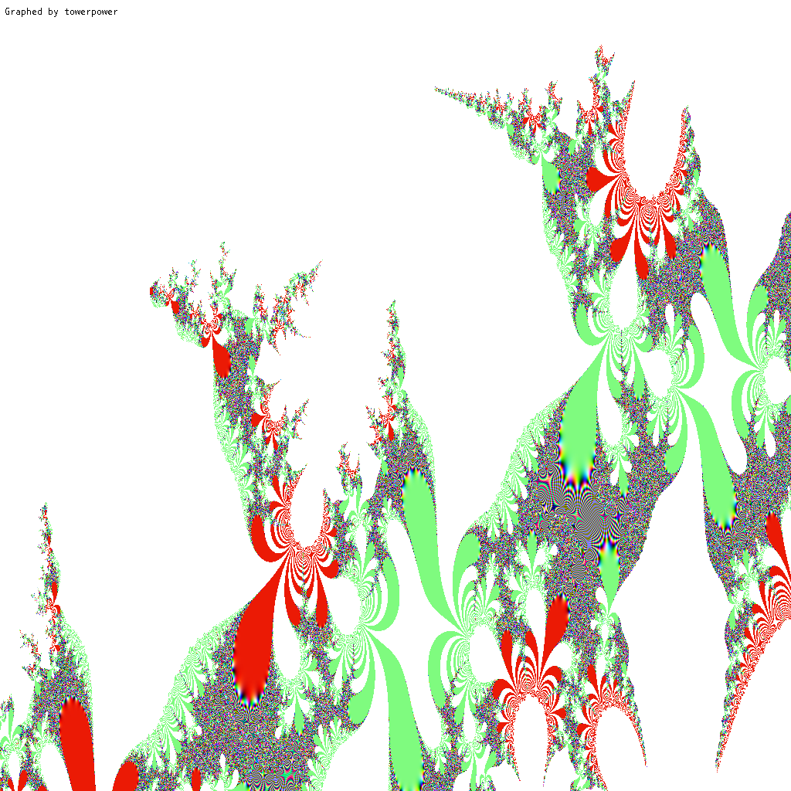
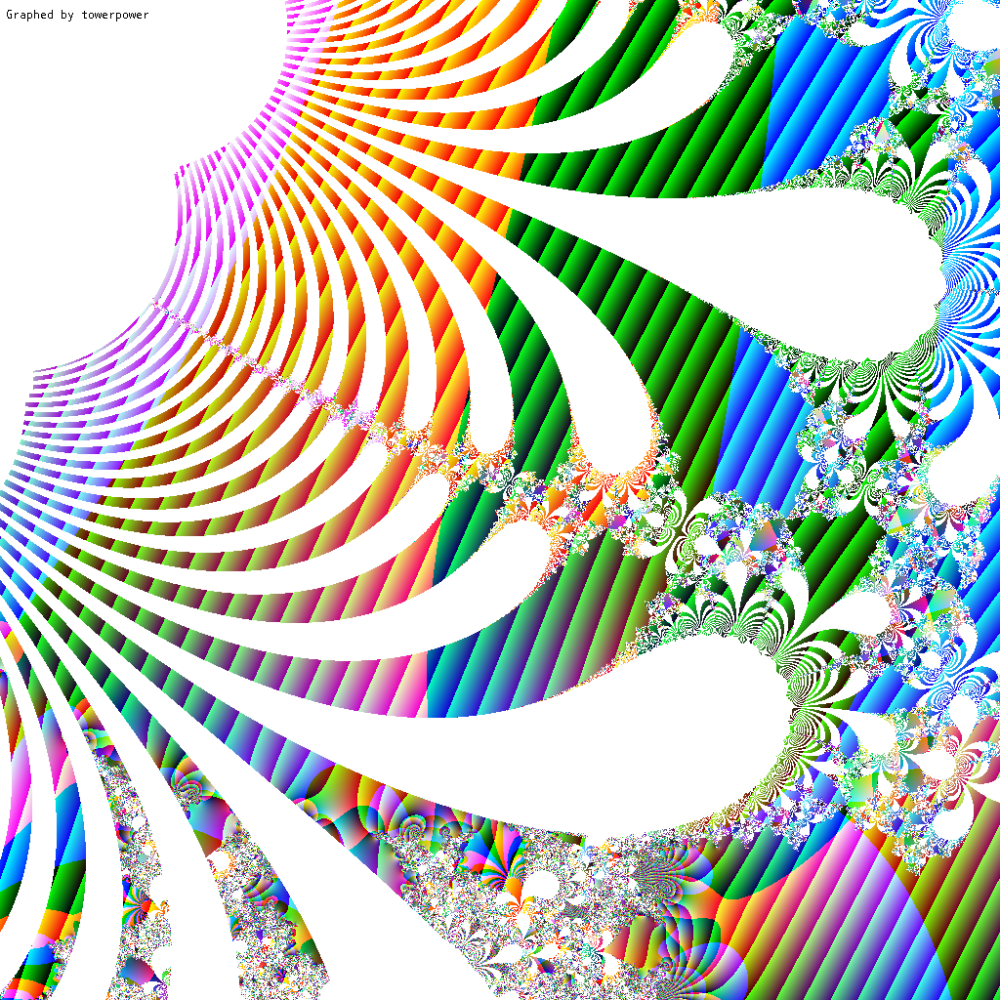
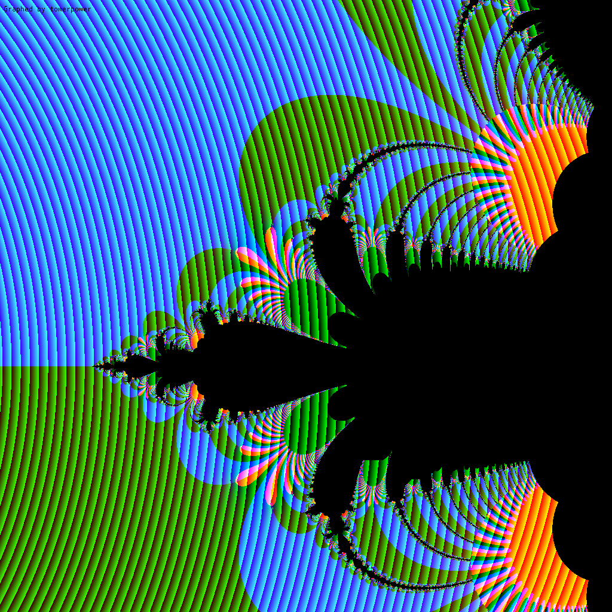
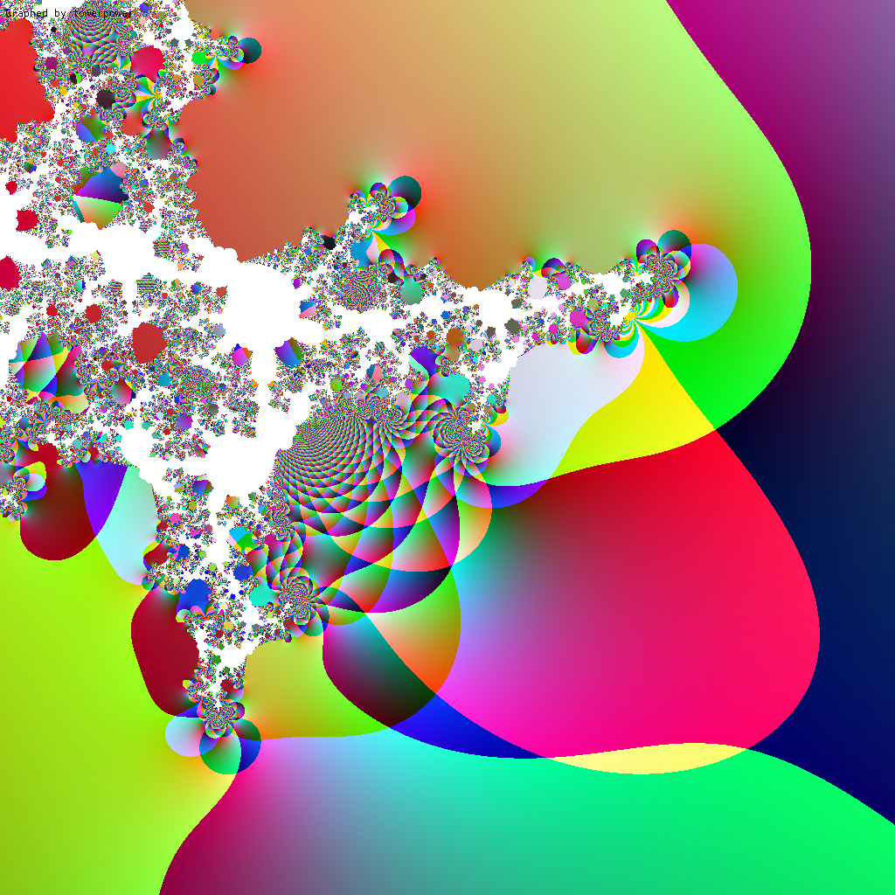
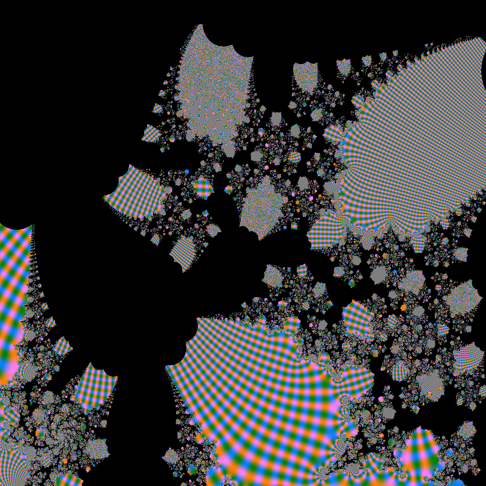
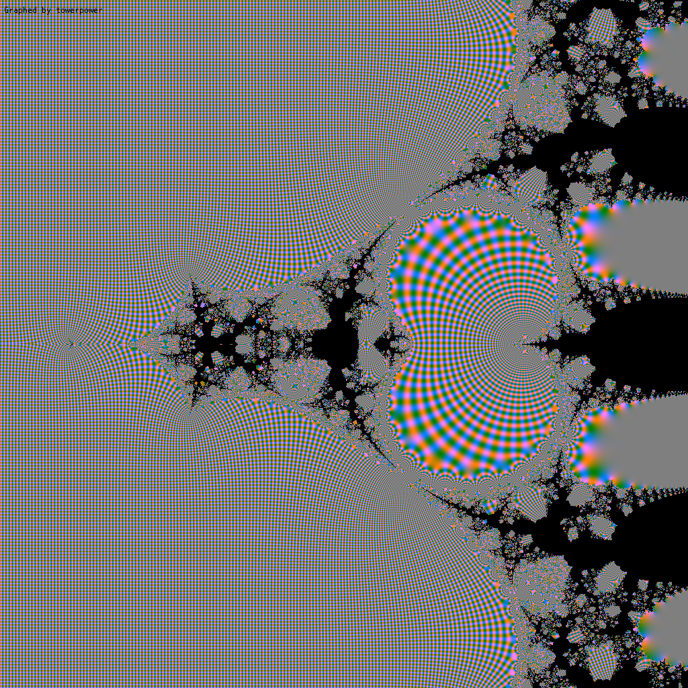
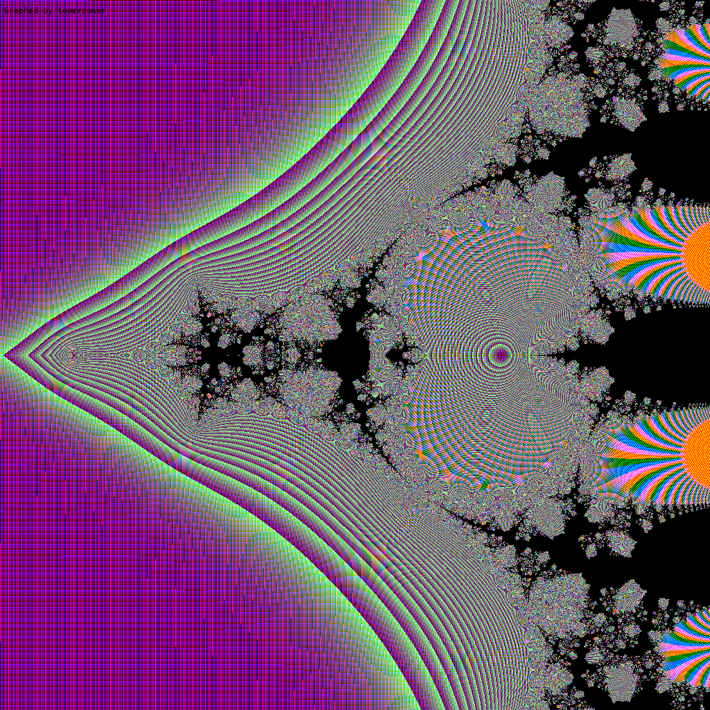

# Towerpower  
A tool made in groovy to show the beauty of math. Visualizes the infinite exponentiation tower of each complex number on the plane:

This is also called tetration escape. Towerpower also has an alternative mode where the base is updated each iteration.
## Gallery

## Notice
The more you zoom in, the more inaccurate values will get, so don't be surprised with weird patterns