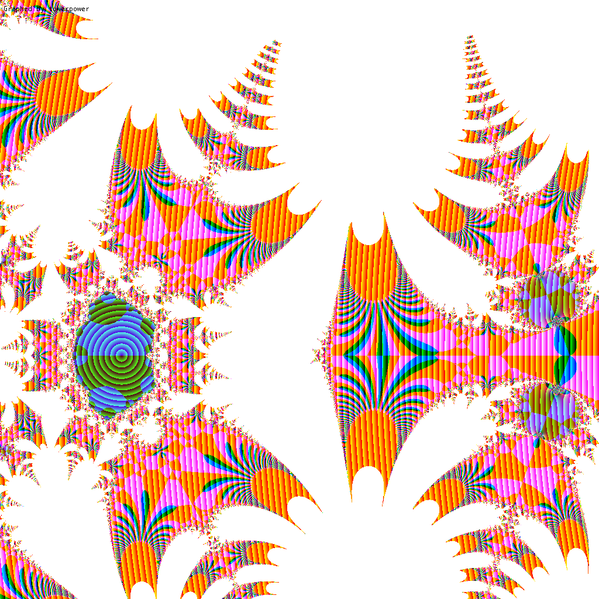

# Towerpower  
A tool made in groovy to show the beauty of math. Visualizes the infinite exponentiation tower of each complex number on the plane:\

    \

This is also called tetration escape. Black means the equation exploded after some iterations.
Towerpower also has alternative modes with slightly modified equations, where you might find unexpected things, 
like a mandelbrot hidden in between the "sin" mode. Check out [`PaintPanel#findPointColor`]((src/main/groovy/me/nov/towerpower/ui/PaintPanel#L260) to find out what each mode does.
You can play with the settings to get even prettier results.
## Gallery

Here are some examples of images towerpower produced.

## Notice
The more you zoom in, the more inaccurate values will get, so don't be surprised with weird patterns.